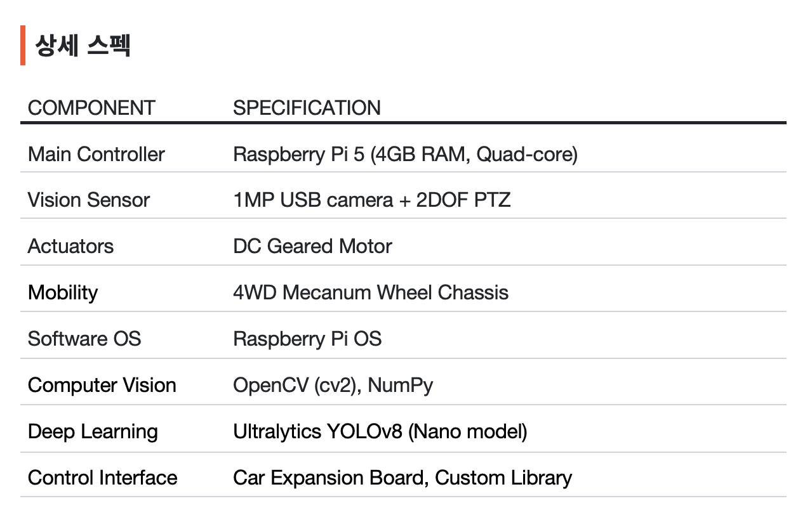
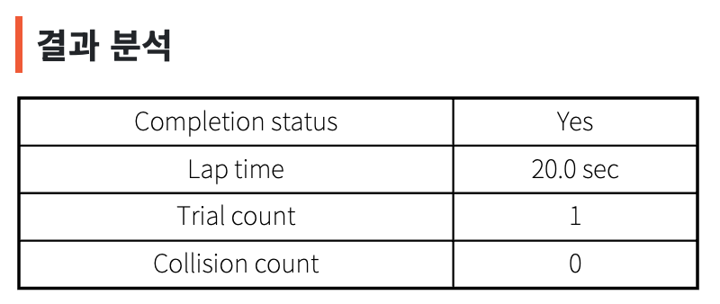
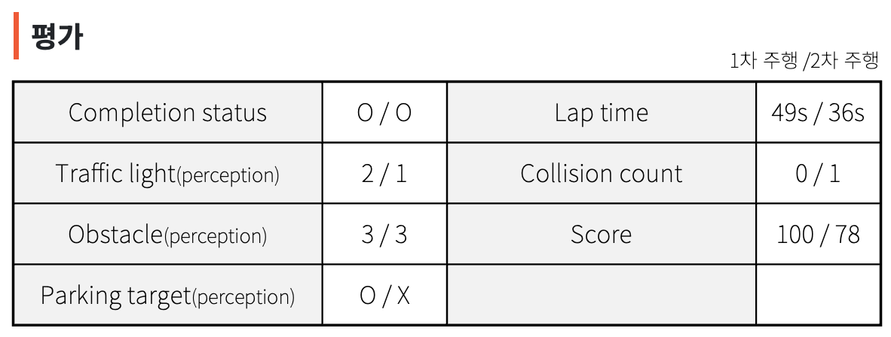

# P Project (Raspbot V2) — 자율주행 Phase 1

**데모 영상(YouTube)**  
- 평가 영상: https://youtu.be/N6C1uwtE3lk?si=EAEI3_sOiVXPr-va  
- 1인칭 화면: https://youtu.be/QhH25kdyquQ?si=TwnvQJg0A6bTV1dp  


자율주행 Phase 1 파이프라인을 개인 포트폴리오용으로 정리한 프로젝트입니다.  
팀 프로젝트 기반이며, 개인 포트폴리오용으로 핵심 기여와 기술 요소를 정리했습니다.  
차선 추종(HSV/Lab), YOLO 기반 이벤트 인식, 미션 FSM, LOST 복구까지 하나의 런타임 루프로 통합했습니다.

## 핵심 포인트
- **P1/P2/P3 기반 헤딩 제어**로 직진/커브/S-커브를 안정적으로 추정하고 PID로 조향 제어
- **P3 중심 도로 필터링**으로 노이즈를 제거해 헤딩 추정 안정성 강화
- **YOLOv8 이벤트 인식 + 미션 FSM**으로 신호등/장애물/주차 미션을 상태 기반으로 처리

## 설계 의사결정 요약
- 벽 감지 회피 대신 **검정 도로 기반 차선 추종**으로 전환해 노이즈 급회전 위험을 줄이고 연속 조향을 목표로 설계
- **P1/P2/P3 밴드 헤딩 추정**과 오프셋 정규화(-1~1)로 해상도/ROI 변화에 덜 민감한 제어 파라미터 구조 채택
- **반대편 도로 오인식** 문제를 해결하기 위해 P3가 포함된 도로 덩어리만 남기는 필터링과 방어 가중치 로직으로 조향 안정화
- 조명 변화에 취약한 HSV 한계를 보완하기 위해 **Lab 색공간을 추가**하고 모드 선택형으로 비교/튜닝 가능하게 설계
- **Haar Cascade 대신 YOLOv8n**(Nano) + 커스텀 데이터셋을 선택해 실제 환경 강건성과 확장성 우선
- 단발 판단 대신 **FSM 레이어 구조 + confirm/cooldown + LOST 복구**로 미션 안정성과 회복력 확보

## 상세 문서
- 기술 설명/설정/디버그: `docs/README_technical.md`

## 핵심 로직 (P1/P2/P3 헤딩 제어)
세 개의 밴드(P1, P2, P3)에서 대표점을 추출해 경로를 구성하고, 이를 기반으로 헤딩과 조향을 계산합니다.


## 핵심 로직 (P3 도로 필터링)
P3에 해당하는 도로 영역만 유지해 배경을 제거하고, 커브/직선에서 안정적인 라벨링을 확보합니다.


## 시스템 파이프라인
1) 원본 프레임 입력 → ROI 계산/IPM 변환  
2) HSV/Lab 차선 이진화 → P1/P2/P3 추출  
3) 헤딩 추정 → PID 기반 조향 계산  
4) YOLO 추론 및 이벤트 안정화  
5) 미션 FSM으로 최종 속도/조향 결정  
6) LOST 상태 복구 로직 수행

## 하드웨어/소프트웨어 스펙


- Main Controller: Raspberry Pi 5 (4GB RAM, Quad-core)
- Vision Sensor: 1MP USB camera + 2DOF PTZ
- Actuators: DC Geared Motor
- Mobility: 4WD Mecanum Wheel Chassis
- Software OS: Raspberry Pi OS
- Computer Vision: OpenCV (cv2), NumPy
- Deep Learning: Ultralytics YOLOv8 (Nano)

## 성과 지표
중간 결과와 최종 평가를 이미지로 정리했습니다.



- Completion status: Yes
- Rap time: 20.0 sec
- Trial count: 1
- Collision count: 0



- Completion status: O / O
- Rap time: 49s / 36s
- Traffic light(perception): 2 / 1
- Collision count: 0 / 1
- Obstacle(perception): 3 / 3
- Score: 100 / 78
- Parking target(perception): 0 / X

## 빠른 실행
```bash
python3 scripts/run_phase1.py
python3 scripts/run_phase1.py --mode lab
python3 scripts/run_phase1.py --mode hsv
python3 scripts/run_phase1.py --config configs/phase1_pid.yaml
python3 scripts/run_phase1.py --mock-hw
python3 scripts/run_phase1.py --headless
```

## 코드 구조 (요약)
- `scripts/run_phase1.py`: 실행 엔트리
- `raspbot/runtime/phase1_baseline.py`: 통합 실행 루프
- `raspbot/perception/`: 차선 검출/전처리/YOLO 이벤트
- `raspbot/control/`: PID 및 차량 제어
- `raspbot/planning/mission_fsm.py`: 미션 FSM
- `configs/phase1_pid.yaml`: 주요 파라미터
- `models/yolo/best.pt`: YOLOv8 모델

## 기술 스택
Python, OpenCV, NumPy, Ultralytics YOLOv8, Raspberry Pi OS

## 역할
팀 프로젝트에서 알고리즘 설계, 구현, 튜닝, 테스트를 전담했습니다.

## 라이선스
Copyright © 2025 JiHarang. All rights reserved.
사전 서면 허가 없이 본 소프트웨어의 사용, 복제, 수정, 배포를 금지합니다.
